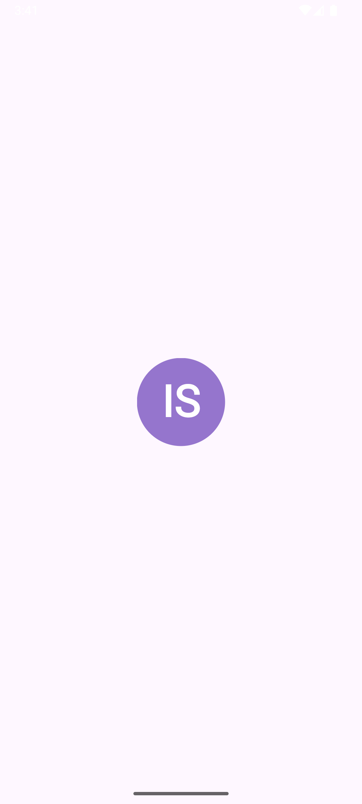
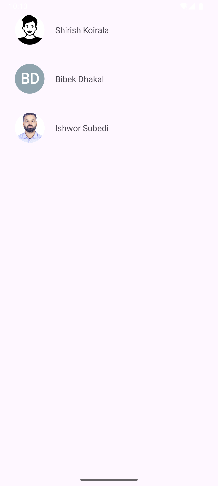

# Texmage  
### Text + Image Drawables for Android

[](LICENSE)  
  


---

## ✨ Overview

**Texmage** is a lightweight Android library for creating high-quality drawables that combine **text** and **images**. Ideal for avatars, badges, profile pictures, or dynamic UI elements. It supports multiple shapes, text styles, caching, and Jetpack Compose integration.

---

## 🧩 Features

- 🔤 Combine initials or labels with images  
- 🔵 Supports Circle, Square, Rounded Rectangle shapes  
- 🌈 Material color palette for dynamic backgrounds  
- ✍️ Custom fonts, text styles, sizes  
- ⚡ Efficient caching to improve performance  
- 📦 Easy integration with Android Views & Jetpack Compose  
- 📱 Optimized for Android API 24+  
- 🪶 Minimal dependencies, lightweight footprint  

---

## 📦 Installation

### Gradle (Groovy)
```groovy
dependencies {
    implementation 'com.github.IshworSubedi13:texmage:v1.0.1'
}
```

### Gradle (Kotlin DSL)
```kotlin
dependencies {
    implementation("com.github.IshworSubedi13:texmage:v1.0.1")
}
```

Sync your project after adding the dependency.

---

## 🚀 Usage

### 🖼️ Classic ImageView Usage

**XML Layout**
```xml
<ImageView
    android:id="@+id/imageView"
    android:layout_width="64dp"
    android:layout_height="64dp" />
```

**In Kotlin/Java**
```java
String userId = "1234";
String userName = "Ishwor Subedi";
String imageUrl = "https://ishworsubedi.com.np/image.jpg";

int bgColor = ColorGenerator.MATERIAL.getColor(userId);
String initials = Utils.getInitials(userName);

IconProvider provider = new IconProvider(context, imageUrl, bgColor, initials);
ImageDrawable imageDrawable = new ImageDrawable(context, provider, Shape.CIRCLE, 12, null);

ImageView imageView = findViewById(R.id.imageView);
imageView.setImageDrawable(imageDrawable);
```

---

### ⚡ Caching Drawables

Use `ImageCache` to reuse drawables and save processing time:
```java
Drawable cachedImage = ImageCache.get(context, userId);
if (cachedImage== null) {
    cachedImage = new ImageDrawable(...);
    ImageCache.put(context, userId, cachedImage);
}
imageView.setImageDrawable(cachedImage);
```

---

### 🧱 Jetpack Compose Support

```kotlin
ComposeAvatar(
    userId = "1234",
    userName = "Ishwor Subedi",
    avatarUrl = "https://ishworsubedi.com.np/image.jpg",
    shape = Shape.Circle,
    size = 64.dp
)
```

---

## 📸 Screenshots

<p align="center">   </p>


---

## 🤝 Contributing

Contributions are always welcome. Please don’t hesitate to report issues or submit pull requests to help us improve the project.

---

## 📄 License

This project is licensed under the MIT License. See the [LICENSE](LICENSE) file for details.

---

## 🙌 Acknowledgments

A big thank you to the open-source community for your support and collaboration.
Thank you for choosing the Texmage Android Library. I trust it adds value and elegance to your Android development experience.
